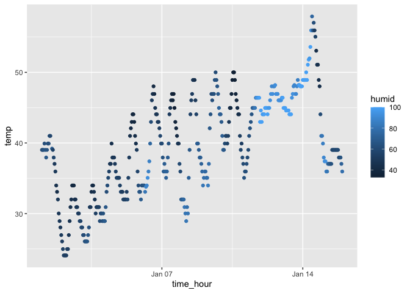

p8105_hw1_pw2550
================
Ada Wang
2026-03-15

# Problem 1

``` r
data("penguins")

data("early_january_weather")
```

- The variables in the “early_january_weather” dataset contains the
  following variables:

  - origin: Weather station. Named origin to facilitate merging with
    nycflights13::flights data.
  - year, month, day, hour: Time of recording.
  - temp, dewp: Temperature and dewpoint in F.
  - humid: Relative humidity.
  - wind_dir, wind_speed, wind_gust: Wind direction (in degrees), speed
    and gust speed (in mph).
  - precip: Precipitation, in inches.
  - pressure: Sea level pressure in millibars.
  - visib: Visibility in miles.
  - time_hour: Date and hour of the recording as a POSIXct date.

- This data contains 358 observations and 15 variables.

- The mean temperature in early January is 39.5821229 Fahrenheit
  degrees.

``` r
temp_plot <- ggplot(early_january_weather, aes(x = time_hour, y = temp, color = humid)) +
  geom_point()

temp_plot
```

<!-- -->

``` r
## save
ggsave("scatterplot of temperature.pdf")
```

    ## Saving 7 x 5 in image

- The temperature rises as the time goes.

# Problem 2

``` r
library(tidyverse)
```

    ## ── Attaching core tidyverse packages ──────────────────────── tidyverse 2.0.0 ──
    ## ✔ dplyr     1.2.0     ✔ readr     2.2.0
    ## ✔ forcats   1.0.1     ✔ stringr   1.6.0
    ## ✔ lubridate 1.9.5     ✔ tibble    3.3.1
    ## ✔ purrr     1.2.1     ✔ tidyr     1.3.2
    ## ── Conflicts ────────────────────────────────────────── tidyverse_conflicts() ──
    ## ✖ dplyr::filter() masks stats::filter()
    ## ✖ dplyr::lag()    masks stats::lag()
    ## ℹ Use the conflicted package (<http://conflicted.r-lib.org/>) to force all conflicts to become errors

``` r
set.seed(100)

sample <- rnorm(10)

df <- data.frame(
  vec_sample = sample,
  vec_logical = sample > 0,
  vec_character = sample(letters, 10),
  vec_factor = factor(sample(c("A", "B", "C"), 10, replace = TRUE))
)

df
```

    ##     vec_sample vec_logical vec_character vec_factor
    ## 1  -0.50219235       FALSE             k          B
    ## 2   0.13153117        TRUE             x          A
    ## 3  -0.07891709       FALSE             r          C
    ## 4   0.88678481        TRUE             l          C
    ## 5   0.11697127        TRUE             c          A
    ## 6   0.31863009        TRUE             s          C
    ## 7  -0.58179068       FALSE             h          B
    ## 8   0.71453271        TRUE             y          B
    ## 9  -0.82525943       FALSE             b          A
    ## 10 -0.35986213       FALSE             d          A
